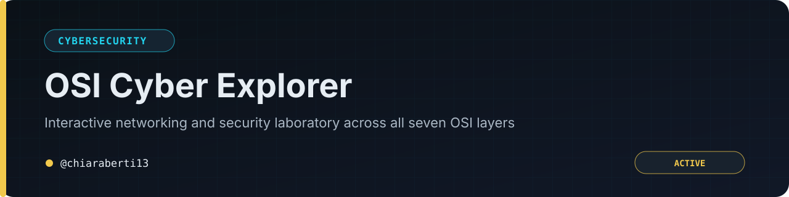

<a href="#-english">🇬🇧 English</a> · <a href="#-italiano">🇮🇹 Italiano</a>

<a href="README.md">Project README</a> · <a href="LICENSE">MIT Licence</a>

---

## 🇬🇧 English

Report suspected vulnerabilities privately through [GitHub Security Advisories](https://github.com/chiaraberti13/OSI-Cyber-Explorer/security/advisories/new). Include the affected commit, browser, reproducible steps and sanitized console output. Do not publish unpatched vulnerabilities in issues.

The laboratory is educational and client-side. Test attack concepts only in controlled environments you own or are explicitly authorized to use.

---

## 🇮🇹 Italiano

Segnala privatamente le vulnerabilità sospette tramite [GitHub Security Advisories](https://github.com/chiaraberti13/OSI-Cyber-Explorer/security/advisories/new). Indica commit, browser, passaggi riproducibili e output della console privo di dati sensibili. Non pubblicare vulnerabilità non corrette nelle issue.

Il laboratorio è didattico e funziona lato client. Sperimenta i concetti di attacco esclusivamente in ambienti controllati di tua proprietà o per i quali possiedi un’autorizzazione esplicita.
