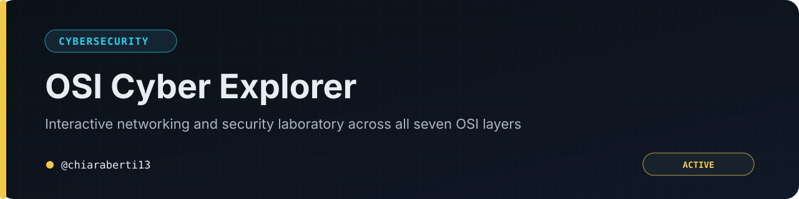

<p align="center"></p>

<p align="center"><a href="#-english">🇬🇧 English</a> · <a href="#-italiano">🇮🇹 Italiano</a></p>

<p align="center"></p>

<p align="center"><a href="README.md">Project README</a> · <a href="docs/THREAT_MODEL.md">Threat model</a> · <a href="LICENSE">MIT Licence</a></p>

---

## 🇬🇧 English

Thank you for helping keep OSI Cyber Explorer and its learners safe. This policy explains what is supported, what to report, how to report it privately, and what response to expect.

The laboratory is educational, deterministic, and client-side. Test attack concepts only in controlled environments you own or are explicitly authorized to use. The versioned [threat model](docs/THREAT_MODEL.md) documents assets, trust boundaries, STRIDE threats, current controls, residual risks, and explicit non-goals.

### Supported versions

The repository currently has no published release or tag. The `package.json` version is project metadata, not a maintained release channel.

| Version or target | Supported |
|---|---|
| Latest commit on `main` | ✅ Yes |
| Official deployment at `https://osi-cyber-explorer.vercel.app` when built from current `main` | ✅ Yes |
| Older commits, local modifications, forks, mirrors, or unofficial deployments | ❌ No |

Security fixes are applied to `main`. Once versioned releases exist, this table must be replaced with an explicit supported-release policy.

### In scope

Report a finding when it has a concrete security impact on this repository or its official deployment, including:

- cross-site scripting, unsafe DOM execution, CSP bypass, or injection into executable browser contexts;
- an unintended runtime network request, data exfiltration, or persistence outside the documented allowlist;
- bypass of input limits that causes meaningful browser resource exhaustion;
- a `localStorage` payload that escapes validation and affects state outside the four non-sensitive preferences;
- exposed credentials, tokens, secrets, or sensitive information belonging to the project;
- dependency, lockfile, GitHub Actions, build, or deployment weaknesses that can alter published code or abuse workflow permissions;
- missing or ineffective security headers on the official deployment when the repository configuration is expected to provide them;
- a discrepancy that makes a supposedly local, deterministic simulation execute commands, send payloads, scan, or contact a real target.

Reports about an upstream dependency are most useful when they identify the affected version in this lockfile and explain reachability or project-specific impact.

### Out of scope

The following are not vulnerabilities in this project:

- factual corrections, translations, accessibility suggestions, or general bugs without security impact; use a normal [GitHub issue](https://github.com/chiaraberti13/OSI-CYBER-EXPLORER/issues/new) for these;
- attacks against systems merely described by the educational content;
- the absence of accounts, authentication, backend, database, telemetry, or AI: these capabilities intentionally do not exist;
- inspection or modification of the four non-sensitive preferences stored in the user's own `localStorage`;
- issues that require a compromised browser, malicious extension, local malware, physical device access, or self-XSS with no impact on another user;
- denial of service against GitHub, npm, Vercel, DNS, Unsplash, or another third-party provider;
- vulnerabilities in a third-party service or package with no demonstrated impact on the repository, build, or official deployment;
- obsolete or vendor-unsupported browsers, old commits, forks, mirrors, local modifications, and unofficial deployments;
- social engineering, phishing, credential attacks, automated high-volume scanning, or tests that degrade availability.

### Private reporting channel

Use [GitHub Security Advisories — Report a vulnerability](https://github.com/chiaraberti13/OSI-CYBER-EXPLORER/security/advisories/new). Do not disclose an unpatched vulnerability in a public issue, discussion, pull request, commit message, or social post.

Include:

1. a concise title and the expected security impact;
2. the affected commit, file, or official URL;
3. browser, operating system, prerequisites, and relevant configuration;
4. minimal, deterministic reproduction steps or a safe proof of concept;
5. sanitized screenshots, console output, request/response metadata, or stack traces;
6. whether the issue affects only local development or the official deployment;
7. a suggested mitigation, if known, and your preferred credit name or a request to remain anonymous.

Never include real credentials, personal data, data taken from third parties, or destructive payloads. Redact tokens, cookies, hostnames, and identifiers that are not necessary to reproduce the finding.

### Fallback channel

If GitHub private vulnerability reporting is unavailable, open a minimal [public issue](https://github.com/chiaraberti13/OSI-CYBER-EXPLORER/issues/new) titled **“Private security contact requested”**. Include only that the private channel is unavailable and request an alternative contact method. Do **not** include the vulnerability class, affected component, reproduction steps, screenshots, logs, payloads, or any other technical detail. Continue only after the maintainer provides a private channel.

### Response targets

These are good-faith targets for a volunteer-maintained project, not contractual service-level guarantees. Timing starts when a complete private report is received.

| Stage | Target |
|---|---|
| Acknowledgement | Within 3 business days |
| Initial validation and severity assessment | Within 7 business days |
| Progress update while unresolved | At least every 14 calendar days |
| Critical remediation target | 7 calendar days after validation |
| High remediation target | 30 calendar days after validation |
| Medium remediation target | 60 calendar days after validation |
| Low remediation target | 90 calendar days or the next planned maintenance cycle |

Severity considers exploitability, affected users, confidentiality, integrity, availability, required privileges, and whether the official deployment is affected. A report may be closed as duplicate, not reproducible, informative, accepted risk, or out of scope, with a reason provided privately.

### Coordinated disclosure process

1. **Receive and acknowledge.** The maintainer confirms receipt through the private advisory and may request missing evidence.
2. **Reproduce and triage.** The finding is validated against current `main` and, where relevant, the official deployment; severity and affected boundaries are recorded.
3. **Contain and remediate.** A minimal fix and regression test are prepared. Exposed credentials are revoked or rotated before code cleanup. Related threat-model and policy entries are updated.
4. **Verify.** Type-check, lint, tests, build, security scans, and the relevant deployment checks must pass before closure.
5. **Coordinate publication.** Reporter and maintainer agree on disclosure timing. The default maximum coordination window is 90 days after validation, but publication should happen sooner once users can obtain the fix. Active exploitation or immediate user harm may require accelerated disclosure.
6. **Publish and credit.** After remediation, the advisory may be published with affected versions, impact, fix, and credit if the reporter consents. Technical details remain private until the agreed date.

Do not open a public pull request containing an exploit or an unfixed vulnerability. A researcher may publish their own write-up after the coordinated date, provided it does not expose third-party data or working secrets.

### Safe-harbor expectations

Good-faith research means that you:

- stay within this policy and applicable law;
- use the least intrusive method and stop once the issue is demonstrated;
- do not access, modify, retain, or disclose another person's data;
- do not perform persistence, social engineering, credential attacks, denial of service, or high-volume automated scanning;
- do not test GitHub, npm, Vercel, Unsplash, or other third-party infrastructure through this project;
- give the maintainer reasonable time to investigate and correct the issue before disclosure.

When these conditions are met, the project will treat the research as authorized for the purpose of this policy and will work to resolve the report constructively. This statement cannot authorize activity against third parties or override applicable law.

### Deployment hardening

Production security headers are versioned in [`vercel.json`](vercel.json). The enforced Content Security Policy allows scripts and connections only from the application origin; the guide image is temporarily limited to `images.unsplash.com`. Inline styles remain enabled because Motion uses element style attributes. Trusted Types enforcement is monitored through a separate Report-Only policy.

After a production deployment, verify the effective headers with:

```bash
curl --head https://osi-cyber-explorer.vercel.app/
```

The [`Dynamic Deployment Security`](.github/workflows/dynamic-security.yml) workflow also validates the effective headers and CSP, then runs a non-authenticated OWASP ZAP Baseline scan after successful deployments and on a weekly production schedule. Versioned JSON/Markdown header findings and ZAP JSON/HTML/Markdown reports are retained as workflow artifacts for 90 days. The target allowlist, comparison policy and local verification commands are documented in [`docs/DYNAMIC_SECURITY.md`](docs/DYNAMIC_SECURITY.md).

Offensive educational material follows the bilingual [offensive-content review policy](docs/OFFENSIVE_CONTENT_REVIEW.md). Every attack scenario and path has a dated checklist entry; CI rejects missing or expired reviews, live third-party targets in the reviewed sources, and reusable payload indicators.

---

## 🇮🇹 Italiano

Grazie per contribuire alla sicurezza di OSI Cyber Explorer e delle persone che lo utilizzano. Questa policy chiarisce quali versioni sono supportate, cosa segnalare, come farlo privatamente e quali tempi di risposta aspettarsi.

Il laboratorio è didattico, deterministico e interamente lato client. Sperimenta i concetti di attacco esclusivamente in ambienti controllati di tua proprietà o per i quali possiedi un'autorizzazione esplicita. Il [threat model](docs/THREAT_MODEL.md) versionato documenta asset, confini di fiducia, minacce STRIDE, controlli attuali, rischi residui e non-obiettivi espliciti.

### Versioni supportate

Il repository al momento non contiene release o tag pubblicati. La versione in `package.json` è un metadato del progetto, non un canale di release mantenuto.

| Versione o destinazione | Supportata |
|---|---|
| Ultimo commit di `main` | ✅ Sì |
| Deployment ufficiale `https://osi-cyber-explorer.vercel.app` quando compilato dal `main` corrente | ✅ Sì |
| Commit precedenti, modifiche locali, fork, mirror o deployment non ufficiali | ❌ No |

Le correzioni di sicurezza vengono applicate a `main`. Quando esisteranno release versionate, questa tabella dovrà essere sostituita con una policy esplicita sulle release supportate.

### In scope

Segnala un problema quando produce un impatto di sicurezza concreto sul repository o sul deployment ufficiale, ad esempio:

- cross-site scripting, esecuzione DOM non sicura, bypass della CSP o injection in contesti eseguibili dal browser;
- richieste di rete runtime non previste, esfiltrazione o persistenza fuori dall'allowlist documentata;
- bypass dei limiti di input capace di causare un esaurimento significativo delle risorse del browser;
- payload in `localStorage` che supera la validazione e altera stato diverso dalle quattro preferenze non sensibili;
- credenziali, token, segreti o informazioni sensibili del progetto esposti;
- debolezze in dipendenze, lockfile, GitHub Actions, build o deployment capaci di alterare il codice pubblicato o abusare dei permessi dei workflow;
- header di sicurezza mancanti o inefficaci sul deployment ufficiale quando la configurazione del repository dovrebbe applicarli;
- discrepanze che fanno eseguire comandi, inviare payload, effettuare scansioni o contattare target reali a una simulazione dichiarata locale e deterministica.

Le segnalazioni relative a una dipendenza upstream sono particolarmente utili quando identificano la versione presente nel lockfile e dimostrano la raggiungibilità o l'impatto specifico sul progetto.

### Fuori scope

Non costituiscono vulnerabilità di questo progetto:

- correzioni fattuali, traduzioni, suggerimenti di accessibilità o bug generici senza impatto di sicurezza; per questi casi usa una normale [issue GitHub](https://github.com/chiaraberti13/OSI-CYBER-EXPLORER/issues/new);
- attacchi contro sistemi semplicemente descritti nei contenuti didattici;
- l'assenza di account, autenticazione, backend, database, telemetria o AI: queste capacità intenzionalmente non esistono;
- lettura o modifica delle quattro preferenze non sensibili nel proprio `localStorage`;
- problemi che richiedono browser già compromesso, estensioni malevole, malware locale, accesso fisico al dispositivo o self-XSS senza impatto su altre persone;
- denial of service contro GitHub, npm, Vercel, DNS, Unsplash o altri provider terzi;
- vulnerabilità in servizi o pacchetti terzi senza un impatto dimostrato su repository, build o deployment ufficiale;
- browser obsoleti o non più supportati dal produttore, vecchi commit, fork, mirror, modifiche locali e deployment non ufficiali;
- social engineering, phishing, attacchi alle credenziali, scansioni automatizzate ad alto volume o test che degradano la disponibilità.

### Canale privato di segnalazione

Usa [GitHub Security Advisories — Report a vulnerability](https://github.com/chiaraberti13/OSI-CYBER-EXPLORER/security/advisories/new). Non divulgare una vulnerabilità non corretta in issue, discussion, pull request, messaggi di commit o post pubblici.

Includi:

1. un titolo sintetico e l'impatto di sicurezza atteso;
2. commit, file o URL ufficiale interessato;
3. browser, sistema operativo, prerequisiti e configurazione rilevante;
4. passaggi minimi e deterministici oppure una proof of concept sicura;
5. screenshot, output della console, metadati request/response o stack trace sanitizzati;
6. indicazione se il problema riguarda soltanto lo sviluppo locale o anche il deployment ufficiale;
7. una possibile mitigazione, se nota, e il nome con cui desideri essere citato oppure la richiesta di restare anonimo.

Non includere mai credenziali reali, dati personali, dati ottenuti da terzi o payload distruttivi. Oscura token, cookie, hostname e identificatori non necessari alla riproduzione.

### Canale di fallback

Se la segnalazione privata di GitHub non è disponibile, apri una [issue pubblica](https://github.com/chiaraberti13/OSI-CYBER-EXPLORER/issues/new) minimale con titolo **“Richiesto contatto privato di sicurezza”**. Indica esclusivamente che il canale privato non è disponibile e chiedi un metodo di contatto alternativo. **Non** inserire classe della vulnerabilità, componente interessato, passaggi di riproduzione, screenshot, log, payload o altri dettagli tecnici. Prosegui soltanto dopo che il maintainer avrà fornito un canale privato.

### Obiettivi di risposta

Sono obiettivi in buona fede per un progetto mantenuto su base volontaria, non garanzie contrattuali di servizio. I tempi decorrono dalla ricezione di una segnalazione privata completa.

| Fase | Obiettivo |
|---|---|
| Conferma di ricezione | Entro 3 giorni lavorativi |
| Validazione iniziale e valutazione della severità | Entro 7 giorni lavorativi |
| Aggiornamento finché il problema resta aperto | Almeno ogni 14 giorni di calendario |
| Correzione Critical | 7 giorni di calendario dalla validazione |
| Correzione High | 30 giorni di calendario dalla validazione |
| Correzione Medium | 60 giorni di calendario dalla validazione |
| Correzione Low | 90 giorni di calendario o il successivo ciclo di manutenzione pianificato |

La severità considera sfruttabilità, utenti coinvolti, confidenzialità, integrità, disponibilità, privilegi necessari e impatto sul deployment ufficiale. Una segnalazione può essere chiusa come duplicata, non riproducibile, informativa, rischio accettato o fuori scope, fornendo privatamente la motivazione.

### Processo di coordinated disclosure

1. **Ricezione e conferma.** Il maintainer conferma la ricezione nell'advisory privato e può richiedere le evidenze mancanti.
2. **Riproduzione e triage.** Il finding viene verificato sul `main` corrente e, quando rilevante, sul deployment ufficiale; vengono registrati severità e confini interessati.
3. **Contenimento e correzione.** Si prepara una correzione minima con test di regressione. Le credenziali esposte vengono revocate o ruotate prima della pulizia del codice. Threat model e policy collegate vengono aggiornati.
4. **Verifica.** Type-check, lint, test, build, scansioni di sicurezza e controlli pertinenti sul deployment devono risultare verdi prima della chiusura.
5. **Coordinamento della pubblicazione.** Reporter e maintainer concordano la data di disclosure. La finestra massima predefinita è 90 giorni dalla validazione, ma la pubblicazione dovrebbe avvenire prima quando la correzione è disponibile. Sfruttamento attivo o danno immediato può richiedere una disclosure accelerata.
6. **Pubblicazione e credito.** Dopo la correzione, l'advisory può essere pubblicato indicando versioni interessate, impatto, fix e credito con il consenso del reporter. I dettagli tecnici restano privati fino alla data concordata.

Non aprire pull request pubbliche contenenti exploit o vulnerabilità non corrette. Il ricercatore può pubblicare un proprio approfondimento dopo la data concordata, purché non esponga dati di terzi o segreti funzionanti.

### Aspettative di safe harbor

Una ricerca in buona fede richiede di:

- rispettare questa policy e la legge applicabile;
- utilizzare il metodo meno invasivo e fermarsi quando il problema è dimostrato;
- non accedere, modificare, conservare o divulgare dati di altre persone;
- non effettuare persistenza, social engineering, attacchi alle credenziali, denial of service o scansioni automatizzate ad alto volume;
- non testare tramite questo progetto l'infrastruttura di GitHub, npm, Vercel, Unsplash o altri soggetti terzi;
- concedere al maintainer un tempo ragionevole per investigare e correggere prima della divulgazione.

Quando queste condizioni vengono rispettate, il progetto considererà la ricerca autorizzata ai fini di questa policy e collaborerà per risolvere la segnalazione in modo costruttivo. Questa dichiarazione non può autorizzare attività contro terzi né derogare alla legge applicabile.

### Hardening del deployment

Gli header di sicurezza della produzione sono versionati in [`vercel.json`](vercel.json). La Content Security Policy applicata consente script e connessioni solo dall'origine dell'applicazione; l'immagine della guida è temporaneamente limitata a `images.unsplash.com`. Gli stili inline restano abilitati perché Motion usa attributi `style` sugli elementi. L'applicazione di Trusted Types viene monitorata tramite una policy Report-Only separata.

Dopo un deployment di produzione, verifica gli header effettivi con:

```bash
curl --head https://osi-cyber-explorer.vercel.app/
```

Il workflow [`Dynamic Deployment Security`](.github/workflows/dynamic-security.yml) verifica inoltre header e CSP effettivi, quindi avvia una scansione OWASP ZAP Baseline non autenticata dopo i deployment riusciti e con cadenza settimanale sulla produzione. I finding versionati JSON/Markdown sugli header e i report ZAP JSON/HTML/Markdown vengono conservati come artifact per 90 giorni. Allowlist delle destinazioni, criteri di confronto e comandi di verifica locale sono documentati in [`docs/DYNAMIC_SECURITY.md`](docs/DYNAMIC_SECURITY.md).

Il materiale didattico offensivo segue la [policy bilingue di revisione](docs/OFFENSIVE_CONTENT_REVIEW.md). Ogni scenario e percorso d'attacco ha una checklist datata; la CI rifiuta revisioni mancanti o scadute, target reali di terzi nelle sorgenti revisionate e indicatori di payload riutilizzabili.
