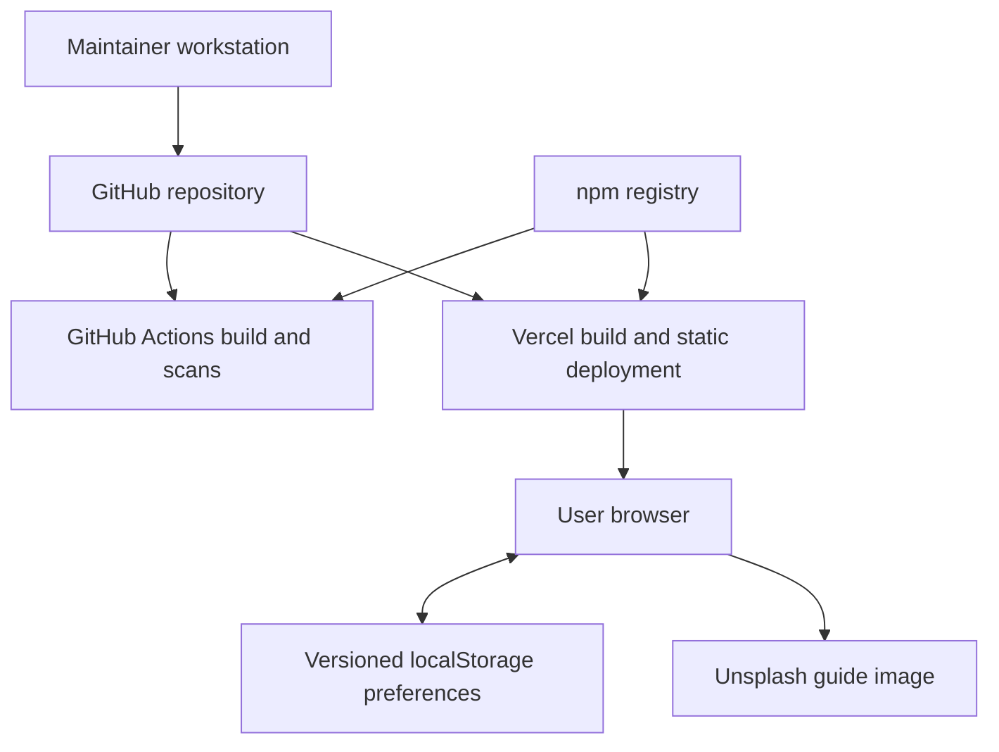

# Threat Model — OSI Cyber Explorer

**Versione / Version:** 1.0  
**Ultima revisione / Last review:** 2026-09-27  
**Ambito / Scope:** branch `main`, applicazione web statica e pipeline di build/deploy

Questo documento descrive il modello di minaccia dell'implementazione presente nel repository. Non è una valutazione di una futura architettura ipotetica: va aggiornato quando cambiano flussi dati, dipendenze, hosting o confini di fiducia.

This document models the implementation currently present in the repository. It is not an assessment of a hypothetical future architecture and must be updated whenever data flows, dependencies, hosting, or trust boundaries change.

## 1. Sintesi architetturale / Architecture summary

OSI Cyber Explorer è una SPA React/TypeScript compilata in asset statici da Vite e distribuita tramite Vercel. Tutte le simulazioni sono deterministiche e vengono eseguite nel browser. Non esistono backend applicativo, database, autenticazione, account utente, API runtime, telemetria o integrazione AI.

OSI Cyber Explorer is a React/TypeScript SPA compiled into static assets by Vite and delivered through Vercel. Every simulation is deterministic and runs in the browser. There is no application backend, database, authentication, user account, runtime API, telemetry, or AI integration.

Il browser conserva soltanto quattro preferenze non sensibili — `language`, `audioEnabled`, `simSpeed`, `hasSeenGuide` — nella chiave versionata `osi-lab-preferences` di `localStorage`. Stato della simulazione, log, input e risultati restano in memoria e vengono eliminati al reload. L'unica richiesta runtime verso terzi consentita dalla CSP è l'immagine della guida su `images.unsplash.com`; Web Audio genera localmente i segnali sonori.

The browser stores only four non-sensitive preferences — `language`, `audioEnabled`, `simSpeed`, and `hasSeenGuide` — in the versioned `osi-lab-preferences` `localStorage` key. Simulation state, logs, inputs, and results remain in memory and disappear on reload. The only third-party runtime request allowed by the CSP is the guide image hosted on `images.unsplash.com`; Web Audio generates sound locally.

Le frecce rappresentano trasferimenti di codice, artefatti o dati. Non esiste un flusso dal browser verso un backend del progetto.

Arrows represent code, artifact, or data transfers. There is no flow from the browser to a project backend.

## 2. Asset e obiettivi di sicurezza / Assets and security objectives

| Asset | Obiettivo / Objective | Sensibilità / Sensitivity |
|---|---|---|
| Codice sorgente e contenuti didattici / Source and educational content | Integrità, accuratezza e tracciabilità / Integrity, accuracy, traceability | Alta / High |
| Bundle e deployment di produzione / Production bundle and deployment | Integrità, autenticità e disponibilità / Integrity, authenticity, availability | Alta / High |
| Pipeline GitHub Actions e token effimeri / CI pipeline and ephemeral tokens | Minimo privilegio e prevenzione di modifiche non autorizzate / Least privilege and prevention of unauthorized changes | Alta / High |
| Dipendenze npm, lockfile e action / npm dependencies, lockfile, and actions | Provenienza, integrità e versioni riproducibili / Provenance, integrity, reproducible versions | Alta / High |
| Preferenze locali / Local preferences | Integrità e ripristino sicuro; nessun requisito di segretezza / Integrity and safe recovery; no confidentiality requirement | Bassa / Low |
| Input e risultati delle simulazioni / Simulation inputs and results | Elaborazione locale, limiti di risorse e assenza di esfiltrazione / Local processing, resource limits, no exfiltration | Media / Medium |
| Reputazione del progetto e contesto etico / Project reputation and ethical context | Contenuti non fuorvianti e uso autorizzato / Non-misleading content and authorized use | Alta / High |
| Disponibilità della documentazione / Documentation availability | Accesso affidabile al laboratorio statico / Reliable access to the static lab | Media / Medium |

Il progetto non raccoglie credenziali o dati personali. Qualsiasi segreto inserito volontariamente in un campo resta nel browser, ma non deve comunque essere usato come dato di prova: il rilevamento didattico redige i valori sensibili e non sostituisce un secret scanner.

The project does not collect credentials or personal data. Any secret voluntarily entered in a field remains in the browser, but must not be used as test data: the educational detector redacts sensitive values and does not replace a secret scanner.

## 3. Attori e capacità / Actors and capabilities

| Attore / Actor | Capacità considerate / Considered capabilities |
|---|---|
| Studente o visitatore / Learner or visitor | Controlla input, URL, DevTools e `localStorage`; può interrompere o ricaricare la sessione / Controls input, URL, DevTools, and `localStorage`; can interrupt or reload the session |
| Contributor non fidato / Untrusted contributor | Può proporre modifiche a codice, contenuti, workflow e lockfile tramite pull request / Can propose code, content, workflow, and lockfile changes through a pull request |
| Attaccante supply-chain / Supply-chain attacker | Può tentare di compromettere un pacchetto npm, un'action o un'origine di download / May attempt to compromise an npm package, an action, or a download origin |
| Attaccante web / Web attacker | Può controllare un sito esterno, un link o contenuto immesso dall'utente, ma non l'origine Vercel / May control an external site, link, or user-entered content, but not the Vercel origin |
| Account maintainer compromesso / Compromised maintainer account | Può tentare modifiche autorizzate in apparenza al repository o al deployment / May attempt apparently authorized repository or deployment changes |
| Provider compromesso / Compromised provider | Caso residuo relativo a GitHub, npm, Vercel, DNS/TLS o Unsplash / Residual case involving GitHub, npm, Vercel, DNS/TLS, or Unsplash |

Estensioni del browser, malware locale e dispositivo già compromesso sono fuori dal controllo dell'applicazione; il modello considera però che possano leggere o alterare tutto ciò che il browser mostra o conserva.

Browser extensions, local malware, and an already-compromised device are outside the application's control; the model nevertheless assumes they can read or alter anything shown or stored by the browser.

## 4. Confini di fiducia / Trust boundaries

### TB-1 — Input utente → logica della SPA / User input → SPA logic

Tutti gli input sono non fidati. JSON, path REST simulati, IPv4/prefissi, wildcard, VLAN e numeri attraversano validatori condivisi con limiti di lunghezza, byte, profondità e nodi dove applicabile. Nessun input genera traffico di rete o viene interpretato come HTML o codice.

All inputs are untrusted. JSON, simulated REST paths, IPv4/prefixes, wildcards, VLANs, and numbers pass through shared validators with length, byte, depth, and node limits where applicable. No input generates network traffic or is interpreted as HTML or code.

### TB-2 — SPA → `localStorage`

`src/store.ts` è l'unico punto autorizzato ad accedere a `localStorage`. Rehydration, migrazione e `partialize` ricostruiscono una allowlist di quattro preferenze. Il contenuto dello storage è controllato dall'utente e non costituisce mai una fonte attendibile o un controllo di autorizzazione.

`src/store.ts` is the only location authorized to access `localStorage`. Rehydration, migration, and `partialize` rebuild an allowlist of four preferences. Storage content is user-controlled and is never a trusted source or an authorization control.

### TB-3 — Browser → origini di rete / Browser → network origins

La CSP limita script, connessioni, frame, form, font, media e worker all'origine prevista. `connect-src 'self'` e i guardrail ESLint impediscono l'introduzione silenziosa di API o telemetria. `img-src` ammette temporaneamente `images.unsplash.com`; il provider riceve i normali metadati di una richiesta web, come indirizzo IP e user agent.

The CSP restricts scripts, connections, frames, forms, fonts, media, and workers to the intended origin. `connect-src 'self'` and ESLint guardrails prevent silent introduction of APIs or telemetry. `img-src` temporarily allows `images.unsplash.com`; the provider receives ordinary web-request metadata such as IP address and user agent.

### TB-4 — Repository → GitHub Actions

Codice, workflow e configurazioni provenienti dal repository diventano input della CI. I workflow usano permessi espliciti, checkout senza credenziali persistenti, timeout e action fissate a SHA. Il token GitHub rimane comunque un asset ad alta sensibilità durante il job.

Code, workflows, and configuration from the repository become CI inputs. Workflows use explicit permissions, checkout without persisted credentials, timeouts, and actions pinned to SHAs. The GitHub token remains a high-sensitivity asset while a job is running.

### TB-5 — npm registry → workstation e CI

Il lockfile viene validato prima dell'installazione senza dipendenze esterne e poi con `lockfile-lint`. Sono ammessi soltanto tarball HTTPS da `registry.npmjs.org` con integrità SHA-512. I lifecycle script sono disabilitati; audit, firme runtime, OSV e SBOM completano i controlli, senza eliminare il rischio di una versione malevola ma validamente pubblicata.

The lockfile is validated before installation without external dependencies and then with `lockfile-lint`. Only HTTPS tarballs from `registry.npmjs.org` with SHA-512 integrity are accepted. Lifecycle scripts are disabled; audit, runtime signatures, OSV, and SBOM add controls without eliminating the risk of a malicious but validly published version.

### TB-6 — Repository → build Vercel → browser / Repository → Vercel build → browser

Vercel serve asset statici tramite HTTPS con CSP, HSTS e ulteriori header versionati in `vercel.json`. La configurazione del repository documenta l'intento; la corretta associazione tra commit, build e deployment rimane dipendente dagli account e dalle impostazioni dei provider.

Vercel serves static assets over HTTPS with CSP, HSTS, and additional headers versioned in `vercel.json`. Repository configuration documents the intent; the correct association among commit, build, and deployment still depends on provider accounts and settings.

## 5. Analisi STRIDE / STRIDE analysis

La valutazione è qualitativa: **bassa**, **media**, **alta**. Il rischio residuo tiene conto dei controlli già presenti nel repository, non di impostazioni amministrative non verificabili dal codice.

The assessment is qualitative: **low**, **medium**, **high**. Residual risk accounts for controls present in the repository, not administrative settings that cannot be verified from code.

| ID | STRIDE | Minaccia / Threat | Controlli esistenti / Existing controls | Rischio residuo / Residual risk |
|---|---|---|---|---|
| TM-01 | Spoofing | Sito clone o deployment non ufficiale induce l'utente a fidarsi di contenuti alterati / A cloned site or unofficial deployment tricks the user into trusting altered content | HTTPS/HSTS sul dominio ufficiale, link demo nel README, nessun login o richiesta credenziali / HTTPS/HSTS on official domain, README demo link, no login or credential requests | Medio / Medium: DNS, account e comunicazione del dominio restano esterni / DNS, accounts, and domain communication remain external |
| TM-02 | Spoofing, Tampering | Pacchetto, tarball o action sostituiti / Package, tarball, or action substitution | Action fissate a SHA; lockfile v3; origine npm, HTTPS e SHA-512 verificati prima e dopo l'installazione; firme runtime / SHA-pinned actions; v3 lockfile; npm origin, HTTPS, and SHA-512 checked before and after install; runtime signatures | Basso–medio / Low–medium: una release malevola firmata o un account upstream compromesso resta possibile / a signed malicious release or compromised upstream account remains possible |
| TM-03 | Tampering | Modifica malevola o errata di codice e contenuti didattici / Malicious or incorrect source and educational-content change | Ruleset attivo su `main`, PR e review CODEOWNERS, sette gate CI, cronologia lineare, blocco cancellazioni/force-push, tracciabilità Git e contenuti separati / Active `main` ruleset, PR and Code Owner review, seven CI gates, linear history, deletion/force-push blocks, Git traceability, and separated content | Basso–medio / Low–medium: accuratezza semantica e compromissione degli account richiedono revisione umana; gli amministratori conservano un bypass esplicito / semantic accuracy and account compromise require human review; administrators retain an explicit bypass |
| TM-04 | Tampering | `localStorage` manipolato ripristina stato arbitrario / Tampered `localStorage` restores arbitrary state | Schema versionato, migrazione conservativa, allowlist e default per campo; nessun dato privilegiato / Versioned schema, conservative migration, allowlist, per-field defaults; no privileged data | Basso / Low |
| TM-05 | Tampering, Elevation of privilege | XSS o esecuzione dinamica tramite input/contenuti / XSS or dynamic execution through input/content | Rendering React, nessun HTML raw, guardrail AST contro sink DOM/eval, CSP enforced, Trusted Types in Report-Only / React rendering, no raw HTML, AST guards against DOM sinks/eval, enforced CSP, Trusted Types Report-Only | Basso–medio / Low–medium: `style-src 'unsafe-inline'` resta necessario per Motion e Trusted Types non è ancora enforced / `style-src 'unsafe-inline'` remains necessary for Motion and Trusted Types is not yet enforced |
| TM-06 | Repudiation | Impossibilità di attribuire un'azione di uno studente / Inability to attribute learner activity | Non applicabile per scelta: nessun account, backend o audit utente; log di simulazione solo in memoria / Intentionally not applicable: no accounts, backend, or user audit; simulation logs are memory-only | Accettato / Accepted: il prodotto non offre non-ripudio e non deve dichiararlo / the product provides no non-repudiation and must not claim it |
| TM-07 | Repudiation, Tampering | Modifiche alla build o alla pipeline difficili da ricostruire / Build or pipeline changes are hard to reconstruct | Cronologia Git, log Actions, pin SHA, artifact SBOM, ledger delle eccezioni / Git history, Actions logs, SHA pins, SBOM artifact, exception ledger | Medio / Medium: non sono ancora prodotti attestazioni e checksum di release (SEC-14) / release attestations and checksums are not yet produced (SEC-14) |
| TM-08 | Information disclosure | Input o segreti inseriti dall'utente esfiltrati / User-entered input or secrets are exfiltrated | Nessuna API/telemetria, rete runtime deny-by-default, input solo in memoria, redazione dei valori sensibili / No API/telemetry, deny-by-default runtime network, memory-only input, sensitive-value redaction | Basso / Low; estensioni o malware locali sono fuori scope / local extensions or malware are out of scope |
| TM-09 | Information disclosure | Risorsa Unsplash espone metadati della visita / Unsplash resource exposes visit metadata | Origine unica in `img-src`, `Referrer-Policy: strict-origin-when-cross-origin`, nessun dato applicativo nell'URL / Single `img-src` origin, strict-origin referrer policy, no application data in URL | Basso / Low; eliminabile portando l'asset in locale (UX-11) / removable by self-hosting the asset (UX-11) |
| TM-10 | Denial of service | Input costruito esaurisce CPU/memoria o blocca la UI / Crafted input exhausts CPU/memory or blocks the UI | Limiti pre-parse su byte/profondità/nodi, visite iterative, limiti sugli input, test ostili / Pre-parse byte/depth/node budgets, iterative traversal, input limits, adversarial tests | Basso–medio / Low–medium: altri calcoli client-side e device deboli richiedono ancora attenzione / other client-side calculations and weak devices still require care |
| TM-11 | Denial of service | Indisponibilità Vercel, DNS, CDN o immagine esterna / Vercel, DNS, CDN, or external-image outage | Applicazione statica, dipendenze runtime minime, immagine non essenziale / Static app, minimal runtime dependencies, non-essential image | Medio / Medium: nessun SLA, multi-region o fallback documentato / no documented SLA, multi-region design, or fallback |
| TM-12 | Elevation of privilege | Codice di PR o dipendenza usa privilegi CI superiori al necessario / PR or dependency code abuses excessive CI privilege | `contents: read` predefinito, permessi per job, niente credential persistence, lifecycle script spenti / Default `contents: read`, per-job permissions, no credential persistence, lifecycle scripts disabled | Basso–medio / Low–medium: scanner che scrivono SARIF richiedono `security-events: write`; impostazioni branch/provider restano critiche / SARIF scanners require `security-events: write`; branch/provider settings remain critical |
| TM-13 | Misuse | Esempi offensivi vengono scambiati per strumenti operativi contro terzi / Offensive examples are mistaken for operational tools against third parties | Simulazioni deterministiche e non esecutive, messaggi “simulation only” e avvertenze in README/SECURITY / Deterministic non-executing simulations, “simulation only” notices, and README/SECURITY warnings | Medio / Medium: alcuni esempi usano ancora indirizzi o servizi reali e contenuti/comandi richiedono revisione continua (SEC-16, NET-01) / some examples still use real addresses or services, and content/commands require continuous review (SEC-16, NET-01) |

## 6. Requisiti e invarianti di sicurezza / Security requirements and invariants

Una modifica non deve essere approvata se viola uno di questi invarianti senza aggiornare prima architettura, controlli e threat model:

A change must not be approved if it breaks any of these invariants without first updating the architecture, controls, and threat model:

1. Le simulazioni restano locali, deterministiche e non inviano pacchetti, exploit o richieste verso target reali. / Simulations remain local and deterministic and send no packets, exploits, or requests to real targets.
2. Nessun input viene interpretato come HTML, JavaScript o comando. / No input is interpreted as HTML, JavaScript, or a command.
3. Non vengono raccolti credenziali, dati personali, analytics o telemetria. / No credentials, personal data, analytics, or telemetry are collected.
4. `localStorage` non è un confine di autorizzazione e contiene soltanto la allowlist di preferenze non sensibili. / `localStorage` is not an authorization boundary and contains only the allowlisted non-sensitive preferences.
5. Una nuova origine di rete richiede finalità, dati trasmessi, allowlist, CSP, test e revisione privacy documentati. / A new network origin requires documented purpose, transmitted data, allowlist, CSP, tests, and privacy review.
6. Una nuova dipendenza richiede lockfile revisionato, installazione senza lifecycle script salvo eccezione esplicita, audit e verifica CI. / A new dependency requires lockfile review, installation without lifecycle scripts unless explicitly excepted, audit, and CI verification.
7. Workflow e action mantengono minimo privilegio, pin immutabili e checkout senza credenziali persistenti. / Workflows and actions retain least privilege, immutable pins, and checkout without persisted credentials.
8. I contenuti offensivi restano contestualizzati per ambienti posseduti o esplicitamente autorizzati. / Offensive content remains framed for owned or explicitly authorized environments.

## 7. Controlli verificabili / Verifiable controls

| Controllo / Control | Evidenza nel repository / Repository evidence | Verifica / Verification |
|---|---|---|
| Validazione input / Input validation | `src/lib/inputValidation.ts`, `src/lib/automation.ts` | Test Vitest e casi limite / Vitest boundary tests |
| Persistenza allowlist / Allowlisted persistence | `src/store.ts`, `src/lib/preferences.ts` | Test di rehydration, migrazione e storage alterato / Rehydration, migration, and tampered-storage tests |
| Guardrail frontend / Frontend guardrails | `eslint.config.js`, `src/securityPolicy.test.ts` | `npm run lint`, `npm test` |
| Header di produzione / Production headers | `vercel.json` | Verifica post-deploy degli header effettivi / Post-deployment check of effective headers |
| Integrità dipendenze / Dependency integrity | `scripts/verify-lockfile.mjs`, `.npmrc`, `package-lock.json` | Bootstrap validator, `lockfile-lint`, signature and vulnerability audits |
| Sicurezza pipeline / Pipeline security | `.github/workflows/` | Permessi, SHA pin, timeout, CodeQL, Gitleaks, OSV, SBOM / Permissions, SHA pins, timeouts, scanners, SBOM |
| Ownership e protezione branch / Ownership and branch protection | `.github/CODEOWNERS`, ruleset GitHub `24081937` | Review CODEOWNERS, una approvazione, branch aggiornato e sette gate CI / Code Owner review, one approval, up-to-date branch, and seven CI gates |
| Eccezioni / Exceptions | `.github/security-exceptions.yml` | Scope, owner, motivazione, controllo compensativo e scadenza / Scope, owner, reason, compensating control, expiry |

## 8. Non-obiettivi e fuori ambito / Non-goals and out of scope

- Nessun backend, database, autenticazione, autorizzazione o gestione sessioni. / No backend, database, authentication, authorization, or session management.
- Nessun modello AI, prompt remoto o tool autonomo. I contenuti che spiegano AI/ML sono soltanto didattici. / No AI model, remote prompting, or autonomous tooling. Content explaining AI/ML is educational only.
- Nessuna telemetria, analytics, advertising o profilazione. / No telemetry, analytics, advertising, or profiling.
- Nessun traffico offensivo reale, scanning, exploitation, command execution o invio di payload. / No real offensive traffic, scanning, exploitation, command execution, or payload delivery.
- Nessuna garanzia contro malware locale, estensioni del browser, browser/OS compromessi o accesso fisico al dispositivo. / No guarantee against local malware, browser extensions, compromised browser/OS, or physical device access.
- Nessuna dichiarazione di conformità normativa o protezione di dati sensibili: l'applicazione non deve riceverli. / No regulatory-compliance claim or sensitive-data protection claim: the application must not receive such data.
- Sicurezza fisica e operativa dei provider GitHub, npm, Vercel, DNS/TLS e Unsplash fuori dal controllo diretto del repository. / Physical and operational security of GitHub, npm, Vercel, DNS/TLS, and Unsplash is outside direct repository control.

## 9. Rischi accettati e lavoro pianificato / Accepted risks and planned work

| Rischio / Risk | Stato / Status | Attività collegata / Related work |
|---|---|---|
| Trusted Types solo Report-Only / Trusted Types Report-Only only | Accettato temporaneamente / Temporarily accepted | SEC-05, dopo verifica compatibilità / after compatibility validation |
| Immagine esterna Unsplash / External Unsplash image | Accettato, basso / Accepted, low | UX-11: asset locale / self-hosted asset |
| Bypass amministrativo del ruleset / Administrative ruleset bypass | Accettato con controllo compensativo: CI verde verificata dopo ogni push diretto / Accepted with compensating control: green CI verified after every direct push | SEC-13 |
| Nessuna attestazione/checksum di release / No release attestation/checksum | Aperto / Open | SEC-14 |
| Nessuna scansione dinamica del deploy / No dynamic deployment scan | Aperto / Open | SEC-15 |
| Revisione editoriale offensiva non ancora formalizzata / Offensive-content review not yet formalized | Aperto / Open | SEC-16 |
| Dipendenza da disponibilità Vercel/DNS / Vercel/DNS availability dependency | Accettato / Accepted | Rivalutare se nasce un requisito SLA / Reassess if an SLA requirement emerges |

## 10. Manutenzione del modello / Model maintenance

Il maintainer revisiona questo documento almeno a ogni release significativa e obbligatoriamente quando una modifica introduce:

The maintainer reviews this document at least for every significant release and whenever a change introduces:

- backend, API, account, autenticazione, database o dati sensibili / backend, APIs, accounts, authentication, databases, or sensitive data;
- analytics, telemetria, AI o una nuova origine di rete / analytics, telemetry, AI, or a new network origin;
- una nuova forma di persistenza o un nuovo sink HTML/DOM / a new persistence mechanism or HTML/DOM sink;
- un nuovo provider di build, hosting, pacchetti o artifact / a new build, hosting, package, or artifact provider;
- esecuzione di codice o traffico di rete originato dalle simulazioni / code execution or network traffic originating from simulations;
- modifica di CSP, permessi GitHub Actions o processo di release / changes to CSP, GitHub Actions permissions, or the release process.

Ogni revisione deve aggiornare data, diagramma, confini, tabella STRIDE, rischi accettati e riferimenti ai controlli. I finding di sicurezza seguono il processo descritto in [`SECURITY.md`](../SECURITY.md); i controlli automatizzati e le eccezioni sono descritti in [`docs/SECURITY_SCANNING.md`](SECURITY_SCANNING.md).

Every review must update the date, diagram, boundaries, STRIDE table, accepted risks, and control references. Security findings follow [`SECURITY.md`](../SECURITY.md); automated controls and exceptions are documented in [`docs/SECURITY_SCANNING.md`](SECURITY_SCANNING.md).
